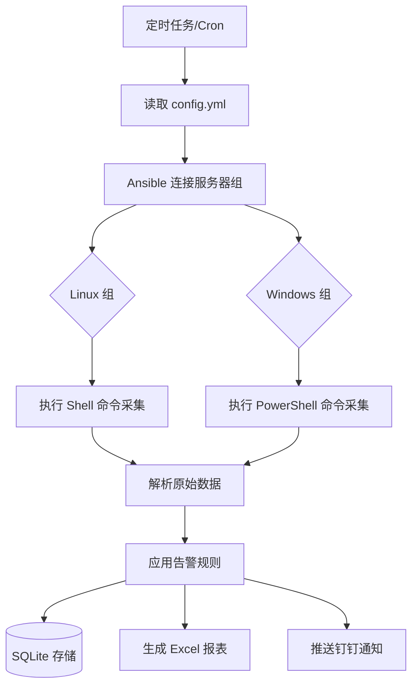
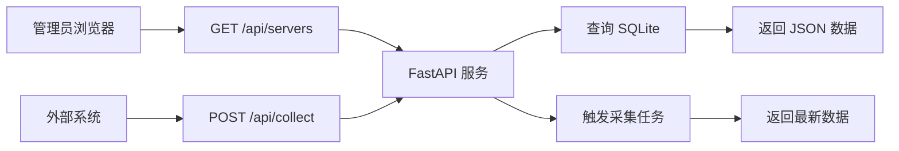

# 服务器监控系统 - 产品需求文档 (PRD)

## 1. 产品概述

基于现有 Ansible + Python 的服务器巡检脚本，升级为**配置驱动 + Web API 化**的现代化监控平台。解决当前手动触发、配置硬编码、数据孤岛等问题，为后续扩展 Web 面板、智能告警、历史趋势分析等功能奠定基础。

**目标用户**: 运维工程师、系统管理员  
**核心价值**: 实现监控数据的自动化采集、标准化输出、可扩展接入

---

## 2. 核心功能

### 2.1 功能模块

| 模块名称 | 功能描述 | 优先级 |
|---------|---------|--------|
| **配置管理中心** | 外置化 YAML 配置文件，管理服务器列表、告警阈值、通知渠道 | P0 |
| **数据采集引擎** | 基于 Ansible 批量采集 Linux/Windows 服务器状态（CPU/内存/磁盘/运行时间） | P0 |
| **RESTful API 服务** | 提供 HTTP 接口供外部系统调用监控数据 | P0 |
| **数据持久化层** | SQLite 存储历史记录，支持趋势查询 | P1 |
| **Web 可视化面板** | 简洁的 Dashboard 展示实时状态和历史曲线 | P1 |
| **告警通知系统** | 钉钉 Webhook 推送异常告警（预留接口） | P2 |

### 2.2 页面/接口详情

| 页面/接口名称 | 核心功能 | 详细描述 |
|--------------|---------|---------|
| **API: GET /api/servers** | 获取所有服务器实时状态 | 返回 JSON 格式的服务器列表，包含 CPU、内存、磁盘等指标 |
| **API: GET /api/servers/{ip}** | 获取单台服务器详情 | 返回指定 IP 的详细监控数据 |
| **API: GET /api/history** | 获取历史记录 | 支持时间范围查询，返回历史快照数据 |
| **API: POST /api/collect** | 手动触发数据采集 | 立即执行一次全网巡检并返回结果 |
| **Dashboard 主页** | 监控大屏展示 | 卡片式布局展示所有服务器状态，颜色编码告警级别 |
| **配置页面 config.yml** | 配置管理 | 编辑服务器分组、告警阈值、钉钉 webhook 等 |

---

## 3. 核心流程

### 3.1 数据采集流程

### 3.2 Web API 访问流程

---

## 4. 用户界面设计

### 4.1 设计风格

- **主色调**: 深蓝科技风 (`#1e3a5f`) + 荧光绿强调色 (`#00ff88`)
- **辅助色**: 告警橙色 (`#ff9500`)、严重红色 (`#ff3b30`)
- **字体**: 标题使用 `JetBrains Mono`（等宽技术感），正文使用 `Inter`
- **布局风格**: 卡片网格布局，暗色主题（`dark mode`），类似 Grafana 风格
- **图标风格**: 使用 Lucide Icons，线性图标
- **动效**: 数据刷新时卡片闪烁，数值变化时平滑过渡动画

### 4.2 页面设计概览

| 页面名称 | 模块名称 | UI 元素说明 |
|---------|---------|------------|
| **Dashboard 主页** | 服务器状态卡片网格 | 每个卡片显示：IP地址、系统版本、CPU/内存/磁盘仪表盘、运行时间、状态指示灯（绿/橙/红） |
| **Dashboard 主页** | 全局统计栏 | 显示：在线服务器数、平均 CPU 使用率、告警数量、最后更新时间 |
| **Dashboard 主页** | 操作按钮区 | [立即采集] [导出Excel] [刷新] 按钮 |
| **历史趋势页** | 时间范围选择器 | 下拉框选择：最近1小时/24小时/7天/30天 |
| **历史趋势页** | 图表区域 | ECharts 折线图展示 CPU/内存/磁盘的历史曲线 |

### 4.3 响应式设计

- **桌面优先**: 1920x1080 分辨率优化，支持多列卡片布局
- **平板适配**: 1024x768 分辨率下自动调整为 2 列布局
- **移动端兼容**: 小屏幕下单列堆叠，保留核心信息展示

---

## 5. 非功能性需求

### 5.1 性能要求

- 单次采集 50 台服务器耗时 < 60 秒
- API 响应时间 < 500ms（查询场景）
- 并发支持 ≥ 10 个请求

### 5.2 可维护性

- 配置文件热加载（修改后无需重启服务）
- 代码模块化，采集逻辑与展示逻辑分离
- 完善的错误日志和异常处理

### 5.3 安全性

- API 支持 Token 认证（可选）
- 敏感信息（密码、webhook）存储在配置文件中，不硬编码
- 输入参数校验和 SQL 注入防护

---

## 6. 后续扩展规划（Phase 2+）

- [ ] 对接 Prometheus + Grafana 工业级监控
- [ ] 智能异常检测（基线对比、趋势预测）
- [ ] 多渠道告警（邮件、短信、企业微信）
- [ ] 自动化运维（告警联动脚本执行）
- [ ] CMDB 资产管理集成
