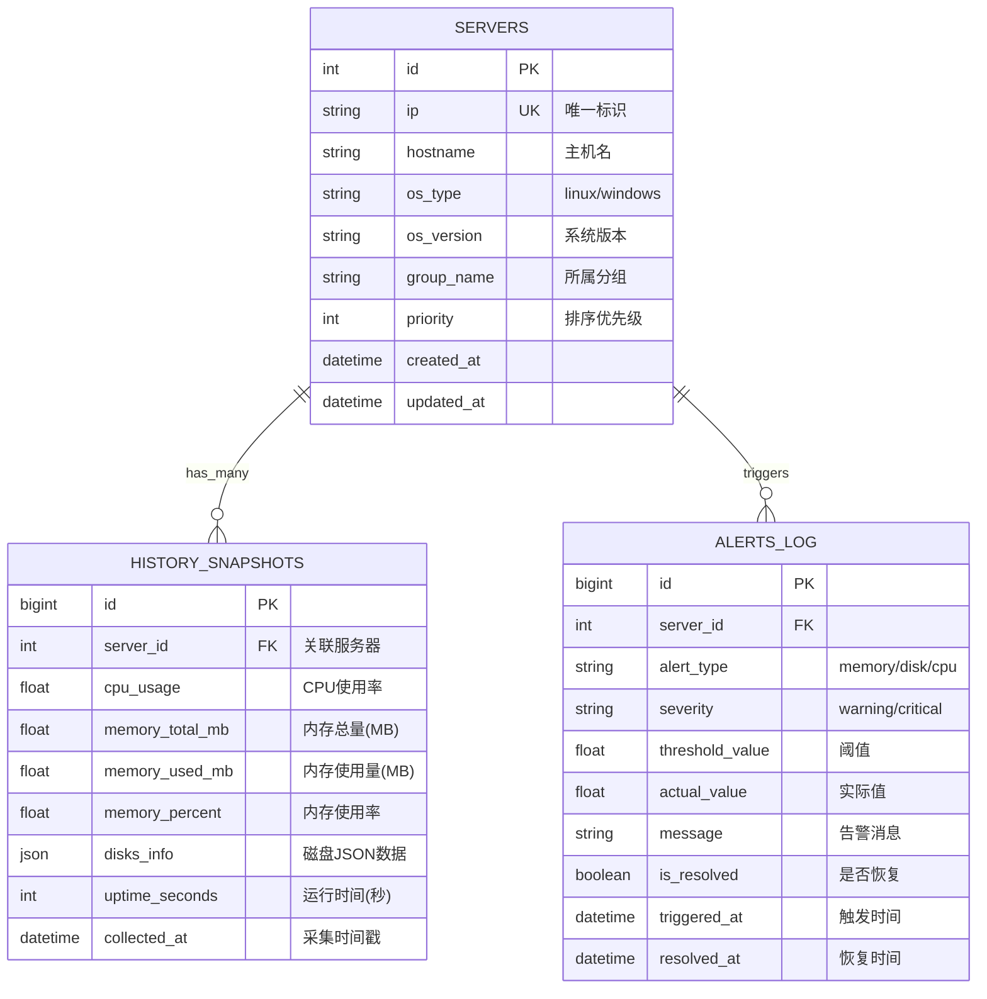

# 服务器监控系统 - 技术架构文档

## 1. 架构设计

```mermaid
graph TB
    subgraph 前端[前端层 - Vue 3 + TypeScript]
        A[Dashboard 页面]
        B[历史趋势页]
        C[配置管理页]
    end
    
    subgraph API层[API 网关 - FastAPI]
        D[/api/servers]
        E[/api/history]
        F[/api/collect]
        G[/api/config]
    end
    
    subgraph 业务逻辑层[业务逻辑层]
        H[数据采集模块<br/>inspect_ops.py]
        I[配置管理模块<br/>config_loader.py]
        J[告警引擎<br/>alert_engine.py]
        K[报表生成器<br/>excel_generator.py]
    end
    
    subgraph 数据层[数据持久化层]
        L[(SQLite<br/>monitoring.db)]
        M[config.yml]
        N[Excel 文件]
    end
    
    subgraph 外部服务[外部服务]
        O[Ansible]
        P[钉钉 Webhook]
    end
    
    A & B & C --> D & E & F & G
    D & E --> L
    F --> H
    G --> I
    H --> O
    I --> M
    J --> P
    K --> N
    H --> L
```

---

## 2. 技术选型

### 2.1 后端技术栈

| 组件 | 技术选型 | 版本 | 说明 |
|------|---------|------|------|
| **Web 框架** | FastAPI | ^0.104.0 | 高性能异步框架，自动生成 API 文档 |
| **数据验证** | Pydantic | ^2.5.0 | 数据模型定义和校验 |
| **数据库 ORM** | SQLAlchemy | ^2.0.0 | SQLite 异步支持 |
| **任务调度** | APScheduler | ^3.10.0 | 定时采集任务 |
| **配置解析** | PyYAML | ^6.0 | YAML 配置文件读取 |
| **HTTP 客户端** | httpx | ^0.25.0 | 异步 HTTP 请求（钉钉推送） |
| **现有依赖** | openpyxl, pandas, ansible | - | 保留现有功能 |

### 2.2 前端技术栈

| 组件 | 技术选型 | 版本 | 说明 |
|------|---------|------|------|
| **框架** | Vue 3 | ^3.4.0 | Composition API + TypeScript |
| **构建工具** | Vite | ^5.0.0 | 快速开发体验 |
| **UI 库** | Tailwind CSS | ^3.4.0 | 原子化 CSS |
| **图表库** | ECharts | ^5.4.0 | 数据可视化 |
| **图标库** | Lucide Vue | ^0.300.0 | 现代化图标 |
| **HTTP 客户端** | Axios | ^1.6.0 | API 请求 |

### 2.3 基础设施

| 组件 | 选型 | 说明 |
|------|------|------|
| **数据库** | SQLite 3 | 轻量级，无需额外安装，适合单机部署 |
| **Web 服务器** | Uvicorn | ASGI 服务器，支持异步 |
| **进程管理** | Systemd / Supervisor | 生产环境进程守护 |
| **反向代理** | Nginx（可选） | 静态文件服务和负载均衡 |

---

## 3. 项目目录结构

```
Ops_Reports/
├── .trae/
│   └── documents/
│       ├── prd.md                    # 产品需求文档
│       └── tech_architecture.md      # 技术架构文档（本文件）
│
├── backend/                          # 后端代码
│   ├── main.py                       # FastAPI 应用入口
│   ├── config.py                     # 配置加载器
│   ├── models.py                     # Pydantic 数据模型
│   ├── database.py                   # SQLAlchemy 数据库连接
│   ├── routers/                      # API 路由
│   │   ├── servers.py                # 服务器状态接口
│   │   ├── history.py                # 历史记录接口
│   │   └── collect.py                # 手动采集接口
│   ├── services/                     # 业务逻辑
│   │   ├── collector.py              # 数据采集服务（重构自 inspect_ops.py）
│   │   ├── alert_engine.py           # 告警引擎
│   │   └── excel_generator.py        # Excel 报表生成
│   ├── schemas/                      # 数据库 Schema
│   │   └── models.py                 # ORM 模型定义
│   └── requirements.txt              # Python 依赖
│
├── frontend/                         # 前端代码（Vue 3 + Vite）
│   ├── src/
│   │   ├── main.ts                   # 应用入口
│   │   ├── App.vue                   # 根组件
│   │   ├── views/                    # 页面组件
│   │   │   ├── Dashboard.vue         # 监控主页
│   │   │   └── History.vue           # 历史趋势页
│   │   ├── components/               # 通用组件
│   │   │   ├── ServerCard.vue        # 服务器状态卡片
│   │   │   ├── StatBar.vue           # 统计栏
│   │   │   └── AlertBadge.vue        # 告警徽章
│   │   ├── composables/              # 组合式函数
│   │   │   └── useMonitoring.ts      # 监控数据 hook
│   │   ├── types/                    # TypeScript 类型定义
│   │   │   └── server.ts             # 服务器数据类型
│   │   └── utils/                    # 工具函数
│   │       └── api.ts                # API 请求封装
│   ├── index.html
│   ├── package.json
│   ├── tsconfig.json
│   ├── vite.config.ts
│   └── tailwind.config.js
│
├── config.yml                        # 外部配置文件
├── inspect_ops.py                    # 原始脚本（保留兼容）
├── 一键获取巡检报表.bat               # 原始批处理（保留兼容）
└── README.md                         # 项目说明（可选）
```

---

## 4. API 接口定义

### 4.1 服务器状态接口

#### `GET /api/servers`

**描述**: 获取所有服务器的最新监控状态

**响应示例**:
```json
{
  "code": 200,
  "data": [
    {
      "id": 1,
      "ip": "10.0.0.15",
      "hostname": "monitor-server",
      "os_version": "Rocky Linux 9.6",
      "uptime": "15天 03小时",
      "cpu_usage": 23.5,
      "memory": {
        "total_gb": 16.0,
        "used_gb": 12.8,
        "usage_percent": 80.0,
        "status": "warning"
      },
      "disks": [
        {
          "mount_point": "/",
          "size_gb": 50,
          "used_gb": 35,
          "usage_percent": 70.0,
          "status": "normal"
        }
      ],
      "last_update": "2026-05-21T10:30:00Z",
      "overall_status": "warning"
    }
  ],
  "meta": {
    "total": 10,
    "online": 9,
    "alert_count": 2
  }
}
```

---

#### `GET /api/servers/{ip}`

**描述**: 获取指定 IP 服务器的详细信息

**路径参数**:
| 参数 | 类型 | 必填 | 说明 |
|------|------|------|------|
| ip | string | 是 | 服务器 IP 地址 |

---

#### `POST /api/collect`

**描述**: 手动触发一次全网数据采集

**请求体** (可选):
```json
{
  "group": "all_linux",  // 可选：指定采集组
  "force": true          // 是否强制重新采集
}
```

**响应**:
```json
{
  "code": 200,
  "message": "采集任务已启动",
  "task_id": "uuid-xxx",
  "estimated_time": "45秒"
}
```

---

### 4.2 历史记录接口

#### `GET /api/history`

**查询参数**:
| 参数 | 类型 | 默认值 | 说明 |
|------|------|--------|------|
| ip | string | null | 过滤指定服务器 |
| start_time | string | 24小时前 | 开始时间（ISO 8601） |
| end_time | string | 当前时间 | 结束时间 |
| interval | string | 1h | 数据聚合间隔（5m/1h/1d） |

**响应**:
```json
{
  "code": 200,
  "data": {
    "timestamps": ["2026-05-20T10:00:00Z", "..."],
    "series": [
      {
        "ip": "10.0.0.15",
        "cpu_usage": [23.5, 25.1, ...],
        "memory_percent": [80.0, 82.3, ...],
        "disk_percent": [70.0, 71.2, ...]
      }
    ]
  }
}
```

---

### 4.3 配置管理接口

#### `GET /api/config`

**描述**: 获取当前配置（脱敏处理）

#### `PUT /api/config`

**描述**: 更新配置（需要认证）

---

## 5. 服务器架构图

```mermaid
graph LR
    subgraph Controller[路由控制器]
        A[servers.py]
        B[history.py]
        C[collect.py]
    end
    
    subgraph Service[业务服务层]
        D[CollectorService]
        E[AlertService]
        F[HistoryService]
        G[ConfigService]
    end
    
    subgraph Repository[数据访问层]
        H[ServerRepository]
        I[HistoryRepository]
        J[ConfigRepository]
    end
    
    subgraph Database[(SQLite)]
        K[servers 表]
        L[history_snapshots 表]
        M[alerts_log 表]
    end
    
    A --> D
    A --> H
    B --> F
    B --> I
    C --> D
    C --> E
    
    D --> H
    E --> J
    F --> I
    G --> J
    
    H --> K
    I --> L
    J --> M
```

---

## 6. 数据模型设计

### 6.1 ER 关系图



### 6.2 数据库 DDL

```sql
-- 服务器基础信息表
CREATE TABLE IF NOT EXISTS servers (
    id INTEGER PRIMARY KEY AUTOINCREMENT,
    ip TEXT NOT NULL UNIQUE,
    hostname TEXT DEFAULT '',
    os_type TEXT NOT NULL DEFAULT 'linux',
    os_version TEXT DEFAULT '',
    group_name TEXT DEFAULT 'default',
    priority INTEGER DEFAULT 0,
    is_active BOOLEAN DEFAULT 1,
    created_at TIMESTAMP DEFAULT CURRENT_TIMESTAMP,
    updated_at TIMESTAMP DEFAULT CURRENT_TIMESTAMP
);

-- 历史快照表
CREATE TABLE IF NOT EXISTS history_snapshots (
    id INTEGER PRIMARY KEY AUTOINCREMENT,
    server_id INTEGER NOT NULL,
    cpu_usage REAL NOT NULL DEFAULT 0,
    memory_total_mb REAL NOT NULL DEFAULT 0,
    memory_used_mb REAL NOT NULL DEFAULT 0,
    memory_percent REAL NOT NULL DEFAULT 0,
    disks_info TEXT NOT NULL DEFAULT '{}',
    uptime_seconds INTEGER NOT NULL DEFAULT 0,
    collected_at TIMESTAMP DEFAULT CURRENT_TIMESTAMP,
    FOREIGN KEY (server_id) REFERENCES servers(id) ON DELETE CASCADE
);

-- 告警日志表
CREATE TABLE IF NOT EXISTS alerts_log (
    id INTEGER PRIMARY KEY AUTOINCREMENT,
    server_id INTEGER NOT NULL,
    alert_type TEXT NOT NULL CHECK(alert_type IN ('memory', 'disk', 'cpu')),
    severity TEXT NOT NULL CHECK(severity IN ('warning', 'critical')),
    threshold_value REAL NOT NULL DEFAULT 0,
    actual_value REAL NOT NULL DEFAULT 0,
    message TEXT DEFAULT '',
    is_resolved BOOLEAN DEFAULT 0,
    triggered_at TIMESTAMP DEFAULT CURRENT_TIMESTAMP,
    resolved_at TIMESTAMP NULL,
    FOREIGN KEY (server_id) REFERENCES servers(id) ON DELETE CASCADE
);

-- 创建索引以加速查询
CREATE INDEX idx_history_server_time ON history_snapshots(server_id, collected_at);
CREATE INDEX idx_alerts_server_unresolved ON alerts_log(server_id, is_resolved) WHERE is_resolved = 0;
CREATE INDEX idx_alerts_triggered_at ON alerts_log(triggered_at);
```

---

## 7. 配置文件结构 (config.yml)

```yaml
# 服务器监控系统配置文件

# 服务器分组配置
servers:
  groups:
    all_linux:
      - 10.0.0.168
      - 10.0.0.199
      # ... 其他 Linux 服务器
    windows:
      - 10.0.0.x
      # ... Windows 服务器
  
  # 优先级排序（数字越小越靠前）
  priority_list:
    - ip: 10.0.0.168
      priority: 1
    - ip: 10.0.0.199
      priority: 2

# 告警阈值配置
alert_thresholds:
  memory:
    warning: 80      # 80% 橙色警告
    critical: 90     # 90% 红色告警
  disk:
    warning: 85
    critical: 95
  cpu:
    warning: 85
    critical: 95

# 钉钉通知配置
dingtalk:
  enabled: false  # 测试阶段关闭
  webhook_url: "https://oapi.dingtalk.com/robot/send?access_token=YOUR_TOKEN"
  secret: ""  # 签名密钥（可选）
  mention_all: false  # @所有人
  mention_mobiles: []  # @指定手机号

# 数据采集配置
collection:
  cron_expression: "0 8 * * *"  # 每天 8:00 执行
  timeout_seconds: 60  # 单台超时时间
  retry_count: 2  # 失败重试次数

# API 服务配置
api:
  host: "0.0.0.0"
  port: 8000
  debug: false
  cors_origins:
    - "http://localhost:5173"  # 开发环境前端地址
    - "*"  # 生产环境需限制

# 数据库配置
database:
  path: "/root/ops_monitor/monitoring.db"
  retention_days: 30  # 历史数据保留天数

# Excel 报表配置
excel:
  output_dir: "/root/ops_monitor/"
  filename_pattern: "Server_Report_{date}.xlsx"
  auto_generate: true  # 采集后自动生成
```

---

## 8. 部署架构

### 8.1 开发环境

```bash
# 1. 启动后端服务
cd backend
pip install -r requirements.txt
uvicorn main:app --reload --port 8000

# 2. 启动前端开发服务器
cd frontend
npm install
npm run dev  # http://localhost:5173
```

### 8.2 生产环境 (10.0.0.15)

```bash
# 1. 安装依赖
pip install -r backend/requirements.txt

# 2. 构建前端
cd frontend && npm run build

# 3. 使用 Supervisor 守护进程
# /etc/supervisor/conf.d/monitoring.conf
[program:monitoring-api]
command=/usr/local/bin/uvicorn main:app --host 0.0.0.0 --port 8000
directory=/root/ops_monitor/backend
autostart=true
autorestart=true
user=root

# 4. 设置定时任务
crontab -e
0 8 * * * cd /root/ops_monitor && python3 -m scripts.collect >> /var/log/monitoring.log 2>&1
```

---

## 9. 安全考虑

1. **API 认证**: 生产环境建议启用 JWT Token 或 API Key
2. **HTTPS**: 使用 Nginx 反向代理 + SSL 证书
3. **输入校验**: 所有 API 参数使用 Pydantic 严格校验
4. **SQL 注入防护**: 使用 ORM 参数化查询
5. **敏感信息保护**: 配置文件权限设置为 600，避免明文密码提交到 Git

---

## 10. 性能优化策略

1. **数据库优化**: 定期清理过期历史数据（retention_days），建立合理索引
2. **缓存机制**: Redis 缓存热点数据（可选，后续扩展）
3. **异步采集**: 使用 asyncio + httpx 并发采集多台服务器
4. **前端优化**: 虚拟滚动渲染大量服务器卡片，按需加载历史数据
5. **CDN 加速**: 静态资源使用 CDN 分发（生产环境）
